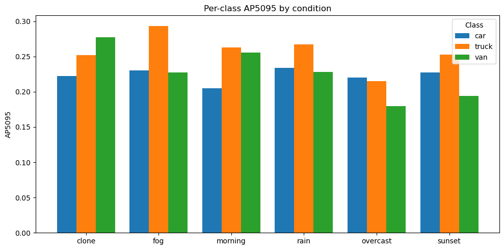
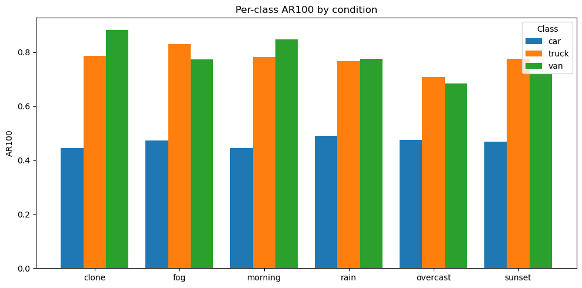

# Perception Robustness Analysis through ODD Variation

## Introduction  
This repository contains a personal exploration project in computer vision, aimed at evaluating the robustness of YOLO object detection under varying **Operational Design Domain (ODD)** conditions.  
The project uses the **VKITTI2** dataset to study how detection performance shifts with environmental changes such as fog, rain, and lighting variations.  

---

## Dataset  
We use the **Virtual KITTI 2 (VKITTI2)** dataset, a synthetic clone of the real KITTI dataset generated in Unity/CLARA.  

- **Scenes:** 5 scenes (01, 02, 06, 18, 20), each with ~200–300 images.  
- **Conditions:** *clone* (baseline), *fog*, *rain*, *morning*, *overcast*, and *sunset*.  
- **Camera view:** Only **Camera_0** is used for consistency.  
- **Classes of interest:** *car*, *truck*, *van* — the most relevant for autonomous driving.  

---

## Methodology  
- **Preprocessing:** Conversion of VKITTI2 annotations into YOLO format.  
- **Training strategy:**  
  - Quota-based sampling across conditions: more images from favorable conditions (*clone, overcast, morning*), fewer from adverse ones (*fog, rain, sunset*).  
  - Balanced validation set: equal number of images per condition to ensure fair comparison.  
- **Framework:** Training performed with the **Ultralytics YOLO** implementation.  
- **Evaluation:** Conducted using the **COCO framework**, reporting AP and AR metrics across IoU thresholds and object scales.  

---

## Results  
The fine-tuned model clearly outperforms the pre-trained YOLO baseline, especially in **recall (AR100 ≈ 0.7)**. Training on synthetic driving data like **VKITTI2** helps the detector capture most objects in the scene, even under a variety of environmental conditions.  

however, the relatively low **mAP@[0.5:0.95] (≈ 0.25)** shows that while the model can find objects, its bounding box alignment and class confidence are not yet precise enough for reliable deployment. This precision gap appears consistently across conditions and classes, reflecting the challenge of building a detector that is both **sensitive and accurate**.  

Looking at conditions, **clone performs best** as expected, but **fog is surprisingly robust**, while **overcast and sunset degrade the most**. This points to **non-intuitive failure modes**: effects that humans would expect to be difficult (*fog*) are less damaging to the model than subtle lighting shifts that reduce contrast.  

Looking at classes, **cars remain harder to detect** than trucks and vans — likely due to their smaller size, greater visual variability, and heavier representation in the dataset. **Trucks perform best in adverse conditions**, as their large and distinctive shapes make them easier to recognize even when visibility is poor.  

The figures below summarize **per-class performance across conditions**:  

- **Figure 1 (right):** Per-class **AP@[0.5:0.95]** by condition, showing broadly similar performance across classes, with noticeable degradation under adverse conditions.  
- **Figure 2 (left):** Per-class **AR@100** by condition, highlighting the recall gap between cars (lower) and the larger classes (trucks, vans), which remain easier to detect under all conditions.  

  
  

---

## References  
- [Virtual KITTI 2 dataset](https://europe.naverlabs.com/proxy-virtual-worlds-vkitti-2/) 
- [Ultralytics YOLO](https://docs.ultralytics.com/)
